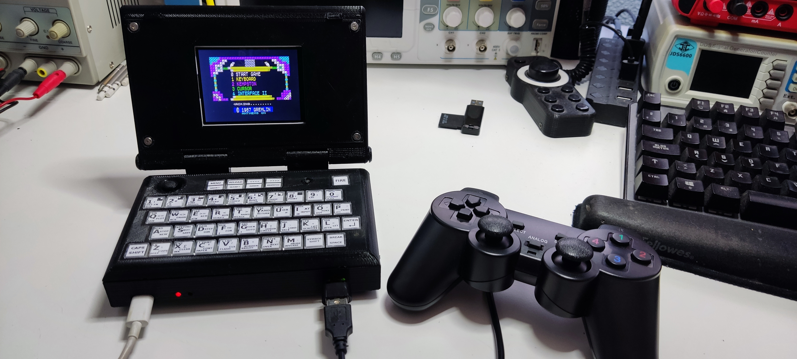

# ZX_Spectrum_Portable
Zx Spectrum portable, Pico-powered
Este proyecto esta basado en el magnifico proyecto PICO-ZXSPECTRUM  de fruit-bat (https://github.com/fruit-bat/pico-zxspectrum/tree/main)
concretamente en el modelo ZxSpectrumPicomputerZxLcd (https://github.com/fruit-bat/pico-zxspectrum/blob/main/docs/ZxSpectrumPicomputerZxLcd.md)
Al igual que muchos otros,mi primer ordenador fue un zx spectrum 48K, con el descubri el maravilloso mundo de la programacion, si bien al final me
decante por la electronica, aquella maquina quedo en mi memoria para siempre, hoy en dia ya con 54 años y peinando muchas canas,sigo jugando de vez en cuando
a algun que otro juego.
Ya hace tiempo como si de un homenaje se tratara,construi un spectrum real montado en una breadboard, si bien aquello no paso de ahi, me abrio el gusanillo
a hacer otros montajes: Un Spectrun Harlequin, algunos ensayos con ESP32 Vga, etc.
Pero hace un tiempo descubri el proyecto de Fruit-bat y me quede enganchado: una sencillez tremenda, flexibilidad , economico , y ademas una version que es compatible con displays lcd, entonces me dije, porque no añadir un teclado mas amigable , una bateria recargable y una carcasa similar a la de un laptop.
Se asemejaria a un Spectrum que nunca existio, pues de aqui salio esta idea.
No soy un gran diseñador ni desarrollador informatico, solo me divierto haciendo este tipo de cosas y siguiendo los pasos de gente mas preparada que yo,tan 
solo compartirlo por si alguien tiene mi misma inquietud y desea construirse uno, divirtiendose como yo lo he hecho.

