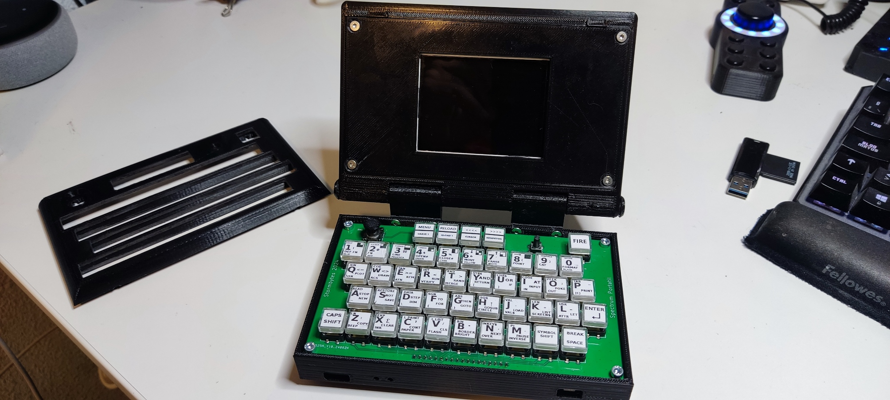
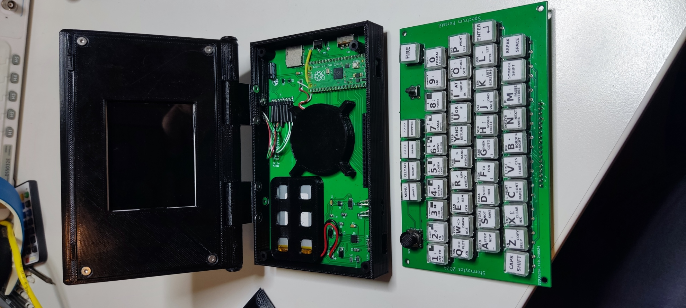
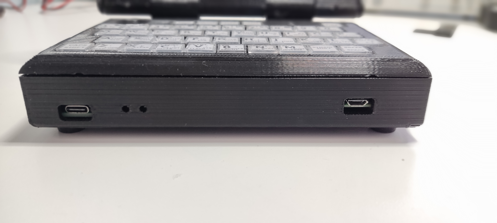

# ZX_Spectrum_Portable
Zx Spectrum portable, Pico-powered
Este proyecto esta basado en el magnifico proyecto PICO-ZXSPECTRUM  de fruit-bat (https://github.com/fruit-bat/pico-zxspectrum/tree/main)
concretamente en el modelo ZxSpectrumPicomputerZxLcd (https://github.com/fruit-bat/pico-zxspectrum/blob/main/docs/ZxSpectrumPicomputerZxLcd.md)
Al igual que muchos otros,mi primer ordenador fue un zx spectrum 48K, con el descubri el maravilloso mundo de la programacion, si bien al final me
decante por la electronica, aquella maquina quedo en mi memoria para siempre, hoy en dia ya con 54 años y peinando muchas canas,sigo jugando de vez en cuando
a algun que otro juego.
Ya hace tiempo como si de un homenaje se tratara,construi un spectrum real montado en una breadboard, si bien aquello no paso de ahi, me abrio el gusanillo
a hacer otros montajes: Un Spectrun Harlequin, algunos ensayos con ESP32 Vga, etc.
Pero hace un tiempo descubri el proyecto de Fruit-bat y me quede enganchado: una sencillez tremenda, flexibilidad , economico , y ademas una version que es compatible con displays lcd, entonces me dije, porque no añadir un teclado mas amigable , una bateria recargable y una carcasa similar a la de un laptop.
Se asemejaria a un Spectrum que nunca existio, pues de aqui salio esta idea.
No soy un gran diseñador ni desarrollador informatico, solo me divierto haciendo este tipo de cosas y siguiendo los pasos de gente mas preparada que yo,tan 
solo compartirlo por si alguien tiene mi misma inquietud y desea construirse uno, divirtiendose como yo lo he hecho.

Como su nombre indica se trata de un emulador de zx spectrum que conta de alimentacion por bateria
y display de 320x240 pixels incorporado,
Dispone de un teclado completo y funcional de zx pectrum incluyendo todos los comandos y textos originales
del modelo 16/48K
Dispone de de un slot para tarjeta micro-sd en la que pueden almacenarse juegos en formatos snap, asi como
en formato tap para tener una experiencia de carga cercana a la original
Por medio de la conexion micro-usb pueden conectarse mandos de juego y teclados e incluso ratones, los mandos
de juego son emulados como joysticks tipo kempston o cursor.
Dispone de un puerto usb tipo C como cargador integrado para su bateria de litio de 1500ma/h
puede utilizarse mientras se carga, siendo recomendable conectar el cargador al conectar dispositivos
al puerto micro-usb.
La duracion aproximada de la bateria es de dos horas y media.
La caja impresa en 3d dispone de tapa en la que se aloja el display, que puede ser cerrada para protejer a este.

Aqui teneis un video de su funcionamiento y construccion:

YOUTUBE VIDEO:

